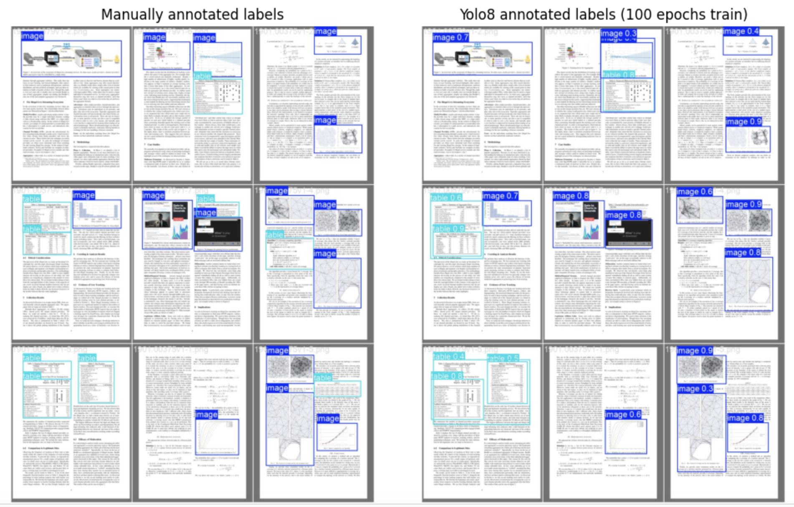
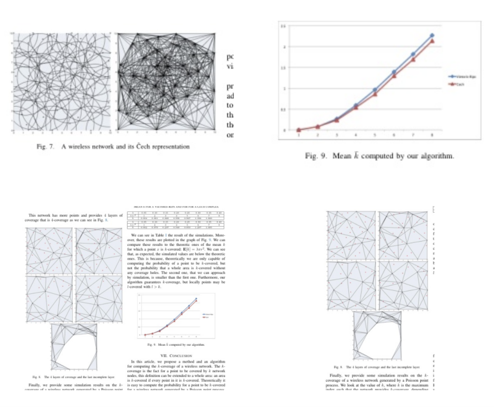
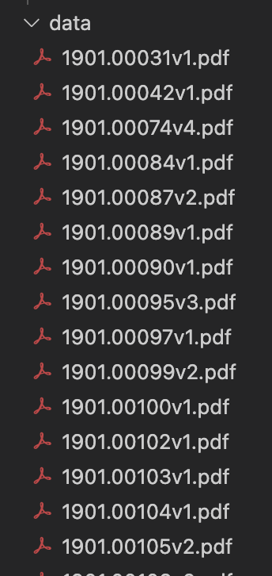
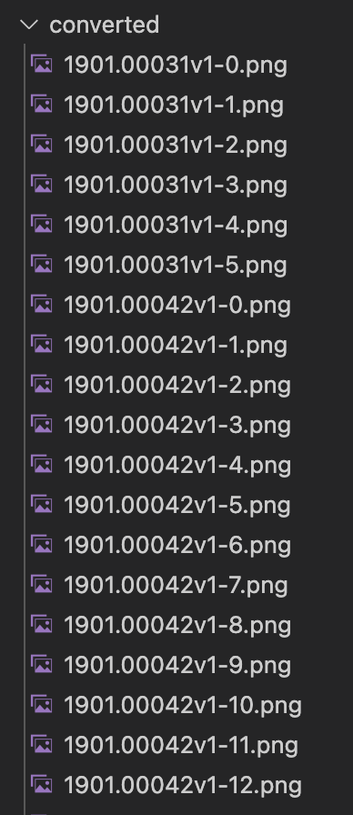

# Use Yolov8 to detect images from PDF

This project is used to solve the image identification problem from PDF files. Using PyMuPDF to identify images, tables from PDF pages (most of them are academic papers) are inaccurate, and it might divide a big image into several small images automatically. Meanwhile, some diagrams drawn from Latex could not be identified. Tables are not easy to get extracted, either.

Use YOLOv8 model to train a few hundreds of manually annnotated PDF pages, the image identification mAP could reach 96%, table mAP could reach around 70%.

*The left image is the ground truth (manually annnotated), and the right image is the trained result. Notice that just a few missing catch* 

*Further processing to crop the identified images*

 

# Reference
The step-by-step tutorial of Yolov8 training process could refer to this post:
https://www.youtube.com/watch?v=m9fH9OWn8YM

Follow the tutorial and use CVAT tool to annotate your data if you want to train your own data.
 

# Install YOLOv8:
https://github.com/ultralytics/ultralytics
 

# Usage Instruction
- generate_dataset.ipynb 
This notebook reads through each raw .pdf file from the `data` folder and converts each page into .jpg file. Store the PDF page image in `converted` subfolder.

- cleanup_dataset.ipynb 
This notebook is used after manually annotating the .jpg files with CVAT. When using CVAT tool to manually annotate PDF images, some PDF images are removed because they might not have any images on it. This notebook is used to pick up those images which are annotated by CVAT, so that `images` and `labels` folders have consistent file names and sizes.

- train_val.ipynb
This notebook is used to train Yolov8 model and validate the result. This is the final notebook you need to run.
 

# Note
- For simplicity, I will not post the `converted` and `data` subfolders.
- For `data` folder, it stores all the raw PDF files.

  

- For `converted` folder, it stores all the converted PDF images. Each image represents one PDF page.

  

- for `dataset` folder, please copy it together with train_val.ipynb if you want to run the notebook in Colab. The sub folders `images` and `labels` contain the annotated images and labels.